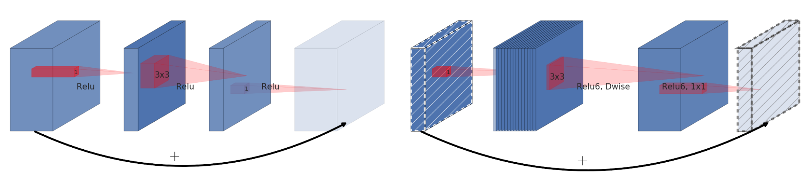

# MobileNet_V2
Unofficial implementation of MobileNet-V2 in PyTorch.

Reference : <a href="https://arxiv.org/pdf/1801.04381.pdf">https://arxiv.org/pdf/1801.04381.pdf</a>
 
<section>

MobileNet-V2 addresses the challenges of using deep learning models in resource constraints environments, e.g., mobile devices and embedded systems. The main idea behind MobileNet-V2 is to replace most of the regular convolutional layers in a conventional CNN model with <b>Inverted Residual blocks</b>. These blocks are made of <b>depth-wise</b> convolutions (with the kernel size of 3 * 3), <b>point-wise</b> convolutions (with the kernel size of 1 * 1), both equipped with <b>non-linear activations</b>, and a final <b>point-wise</b> convolution with linear mapping. The figure below depicts the mechanism of depth-wise, and point-wise convolutional layers, as well as inverted residual blocks.
 

 

<b>PS-1</b>: In the original paper, the activation function for non-linear transformation is <b>ReLU-6</b>. In this implementation, I have replaced ReLU-6 with the regular ReLU.

<b>PS-2</b>: In the original paper, the activation function for non-linear transformation is <b>ReLU-6</b>. In this implementation, I have replaced ReLU-6 with the regular ReLU.

</section>
